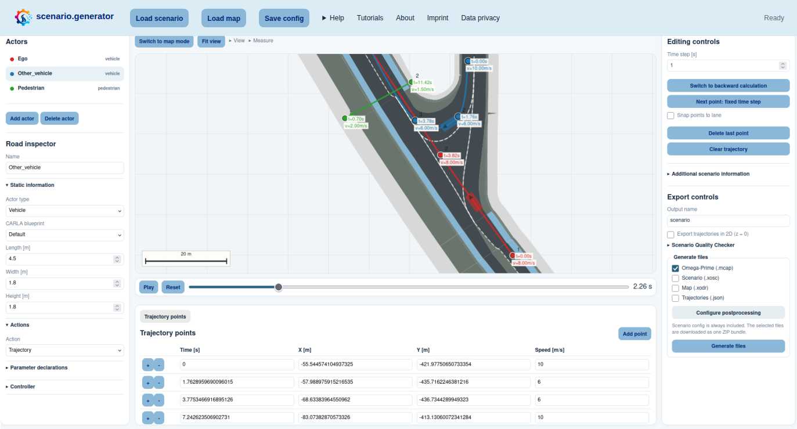

<p align="left"></p>

<p align="left">
  scenario.generator is a web app based workspace to create and export driving scenarios easily and accurately.
</p>

<p align="left">
  <a href="https://scenario.center/generator"><strong>Try scenario.generator online →</strong></a>
</p>



## Example use cases

scenario.generator supports a range of scenario-design workflows and can be
extended for project-specific needs. Typical examples include:

- **Rapid prototyping:** turn a test idea into a multi-actor traffic scenario.
- **Simulation preparation:** create scenario and map inputs for a simulator or
  an automated-driving test environment.
- **Scenario adaptation:** visually inspect and refine existing scenario data
  for a new test purpose.
- **Criticality exploration:** compare traffic interactions and investigate
  near-conflict situations.

## How to use it

scenario.generator provides two complementary authoring modes.

### Trajectory mode

Add vehicles, cyclists, or pedestrians and draw their trajectories on the
interactive canvas. Positions, timestamps, and speeds can be refined in the
trajectory table or velocity profile. An OpenDRIVE map can be loaded as context
and trajectory points can be snapped to its lane centerlines.

### Map mode

Create an OpenDRIVE map from scratch or load an existing one. Road geometry,
lane properties, and connections can be edited before switching back to
trajectory mode to place road users on the map.

In either mode, use the playback and calculated metrics to inspect the result.
Then add scenario details such as actor dimensions, actions, controllers,
environment data, or perception gaps, and export the required files. Selected
postprocessing steps can be applied as part of the export.

For a guided introduction, open
the [tutorial overview](scenario_generator/webapp/documentation/README.md) or
start with one of these examples:

1. [Create an intersecting conflict (no map)](scenario_generator/webapp/documentation/01-intersection-conflict.md)
2. [Build a simple map and drive it](scenario_generator/webapp/documentation/02-create-simple-map.md)
3. [Create a rainy pedestrian crossing](scenario_generator/webapp/documentation/03-import-adapt-map-scenario.md)
4. [Test OpenADStack in OpenADSim](scenario_generator/webapp/documentation/04-openads-scenario.md)

## Outputs

Scenarios can be exported in different formats for further usage:

- `Scenario (.xosc)`: OpenSCENARIO XML with actors and storyboard actions.
- `Map (.xodr)`: an editable or generated OpenDRIVE map.
- `Trajectories (.json)`: sampled trajectories with time, position, speed,
  yaw, dimensions, and optional detection availability.
- `Omega-Prime (.mcap)`: [MCAP](https://mcap.dev/spec) with
  [ASAM OSI](https://www.asam.net/standards/detail/osi/) GroundTruth data and
  map data when available.
- `scenario_config.json`: the editable scenario.generator project state. Saved
  waypoint timestamps and speeds are preserved when the project is loaded
  again. Maps remain separate OpenDRIVE files referenced by the config; export
  bundles include the referenced map automatically.

## Development setup

This repository has one supported local development environment: its
[VS Code Dev Container](https://code.visualstudio.com/docs/devcontainers/containers).
The host only needs:

- [Docker](https://docs.docker.com/get-docker/);
- [Visual Studio Code](https://code.visualstudio.com/); and
- the
  [Dev Containers extension](https://marketplace.visualstudio.com/items?itemName=ms-vscode-remote.remote-containers).

Open the cloned repository in VS Code and select **Dev Containers: Reopen in
Container** from the command palette. The initial container creation installs
the locked Python environment with `uv`, as well as the Node.js packages and
Chromium required by the browser tests. Python, Conda, Node.js, and project
dependencies do not need to be installed on the host.

After the setup completes, start the application from the VS Code terminal:

```bash
uv run --locked scenario.generator
```

VS Code forwards port 8000 automatically. Open the forwarded URL shown by VS
Code, or use [http://localhost:8000](http://localhost:8000).

## Postprocessing and extensions

Postprocessing steps and metric calculations are designed to be modular. To
add your own postprocessing steps or metrics, see the dedicated README files:
- [`scenario_generator/postprocessing_scripts/`](scenario_generator/postprocessing_scripts/README.md)
- [`scenario_generator/metrics/`](scenario_generator/metrics/README.md)

## Acknowledgments

The foundations of scenario.generator were developed within the following
projects:

<table>
  <thead>
    <tr>
      <th width="170">Project</th>
      <th>Funding source</th>
      <th width="170"></th>
    </tr>
  </thead>
  <tbody>
    <tr>
      <td width="170" align="center"><a href="https://www.ika.rwth-aachen.de/de/kompetenzen/projekte/automatisiertes-fahren/4-cad.html"></a></td>
      <td>Funded by the Deutsche Forschungsgemeinschaft (DFG, German Research Foundation), DFG project no. 503852364.</td>
      <td width="170" align="center"></td>
    </tr>
    <tr>
      <td width="170" align="center"><a href="https://synergies-ccam.eu/"></a></td>
      <td>Funded by the European Union's Horizon Europe Research and Innovation Programme under Grant Agreement No 101146542. Views and opinions expressed are those of the author(s) only.</td>
      <td width="170" align="center"></td>
    </tr>
  </tbody>
</table>

> [!IMPORTANT]
> This repository is open source and maintained by the [Institute for Automotive
> Engineering (ika) at RWTH Aachen University](https://www.ika.rwth-aachen.de/).
> For questions, contact opensource@ika.rwth-aachen.de.
