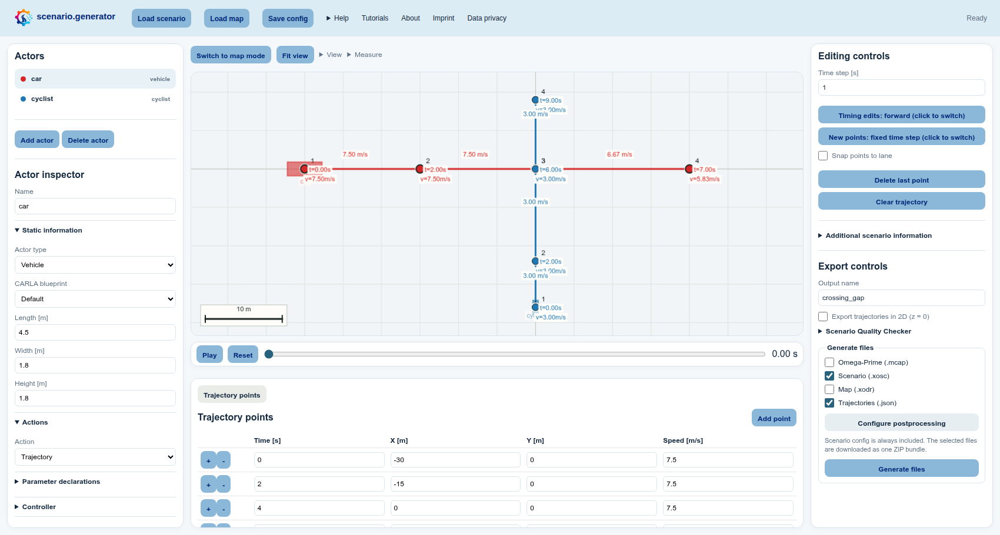
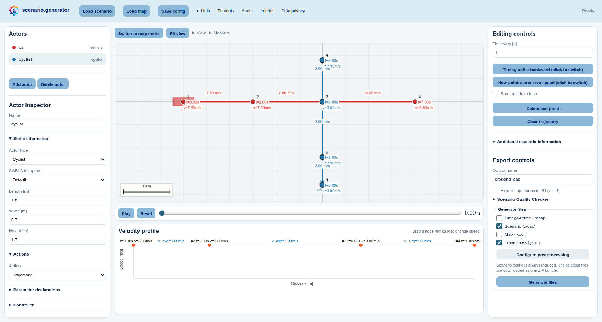

# Create an intersecting conflict (no map)

A car and a cyclist can follow perfectly reasonable paths and still reach the
same place at the wrong time. In this example you create that conflict from
scratch, then turn it into a controlled two-second gap. No map is needed.

**Learning outcomes:** After this example, you can create and refine actor
trajectories, change actor types, edit waypoint timing in both propagation
directions, inspect an intersecting scenario, and choose suitable export
formats.

## Before you start: Trajectory mode

The initial window is already in **Trajectory mode**: selecting an empty
position on the central canvas adds a trajectory point for the selected actor.
Use either a pointer or the canvas keyboard cursor and Enter. The **Switch to map
mode** button above the canvas confirms that trajectory editing is currently
active. You do not need a map for this example. To learn the Map mode and
create a small road network first, follow
[Build a simple map and drive it](02-create-simple-map.md).

> **Optional shortcut:** Open **Load scenario** in the header, select
> **Pass straight intersecting vehicle from right passing straight (.json)**,
> and choose **Load default** to inspect a completed starting point. Choose
> **Upload scenario** in the same dialog for a scenario file from your computer.
> Continue below without loading the default when you want to build every
> trajectory yourself.

## 1. Create a clean intersecting scenario

1. In the **Actors** list on the left, select `vehicle_1`. You can rename it to
   `car` in the **Actor inspector** below the list to make the example easier
   to follow.
2. Decide how you want to adapt its initial trajectory:
   - To start from scratch, select **Clear trajectory** under **Editing
     controls** on the right and select several positions from one side of the
     central canvas to the other. Use either a pointer or the canvas keyboard
     cursor and Enter.
   - To reuse the existing trajectory, drag its points to suitable positions
     on the canvas, or enter exact coordinates in the **Trajectory points**
     table below the canvas.
3. Make the vehicle's path pass through the location where both actors should
   intersect. This can be any waypoint along the trajectory; it does not have
   to be the third point or the centre of the canvas.
4. In the **Actors** list on the left, select `vehicle_2`. You can rename it to
   `cyclist` in the **Actor inspector**. In **Actor inspector → Static
   information**, change **Actor type** to **Cyclist**.
5. Create or adapt the cyclist trajectory in the same way: use **Clear
   trajectory** on the right and select a new path with a pointer or the canvas
   keyboard cursor and Enter. You can instead move the existing points or edit
   coordinates in the table below the canvas. Make this path cross the vehicle
   path at the chosen intersecting location.
6. Select **Fit view** above the canvas. Open **View** beside it and keep point
   indices, waypoint times, speeds, actor names, and bounding boxes visible.

## 2. Give the car priority

1. Under **Editing controls** on the right, leave **Timing edits: forward**
   active.
2. At the intersecting point, enter `4.0` by double-clicking the car's canvas
   time label or by editing **Time [s]** in the **Trajectory points** table.
   Later car points move in time; earlier ones remain fixed.
3. Select the cyclist in the **Actors** list on the left. Under **Editing
   controls** on the right, switch to **Timing edits: backward**.
4. At the intersecting point, enter `6.0` using its canvas time label or the
   **Time [s]** table field. Earlier cyclist points are recalculated while its
   later exit time stays fixed.
5. Compare the two labels: the car arrives at `4.0 s`, the cyclist at `6.0 s`.

> **Why the two switches feel different:** **New points: fixed time step / preserve
> speed** affects only newly selected points. **Timing edits: forward / backward**
> affects edits to existing point times, speeds, and positions.

## 3. Check the result

1. Select **Play** in the playback bar below the canvas and watch the
   intersecting scenario once.
2. Open **Measure → Distance** above the canvas and select two points if you
   want to check their spatial separation.
3. Open **View** above the canvas and enable **TTC min** and **THW min** for an
   additional conflict check.
4. If a label is crowded, drag its point slightly on the canvas or use the
   **Trajectory points** table below the canvas for exact values.

## 4. Export and post-process

1. In **Export controls** on the right, enter any useful **Output name**, for
   example `intersecting_gap`. This only determines the downloaded filenames.
2. In **Generate files** directly below it, choose the formats that match your
   next step:
   - **Scenario (.xosc)** creates an
     [ASAM OpenSCENARIO XML](https://www.asam.net/standards/detail/openscenario-xml/)
     file for a simulator or other OpenSCENARIO-compatible tooling.
   - **Trajectories (.json)** is useful when you want the selected points and
     actor data in an easy-to-inspect format for analysis or custom scripts.
   - **Omega-Prime (.mcap)** is a useful exchange format for road-traffic data.
     [Omega-Prime](https://github.com/ika-rwth-aachen/omega-prime) files are
     compatible with many tools available through the
     [SYNERGIES Marketplace](https://app.synergies-ccam.eu/).
   - **Map (.xodr)** creates an
     [ASAM OpenDRIVE](https://www.asam.net/standards/detail/opendrive/) road
     network. It is unnecessary here because this example deliberately has no
     map.

   Select both **Scenario (.xosc)** and **Trajectories (.json)** if you want to
   try the simulation and data-processing workflows together.
3. If you selected XOSC, choose **Configure postprocessing** in the same panel,
   select `set_stop_simulation_time`, and set **Stop simulation time** to `12`
   seconds.
4. Select **Generate files** at the bottom of the right panel. The configured
   postprocessor runs during export. The ZIP always contains the editable
   scenario configuration and additionally contains every selected format.

You now have a compact regression scenario whose expected result is easy to
state: the cyclist enters the conflict point two seconds after the car.
