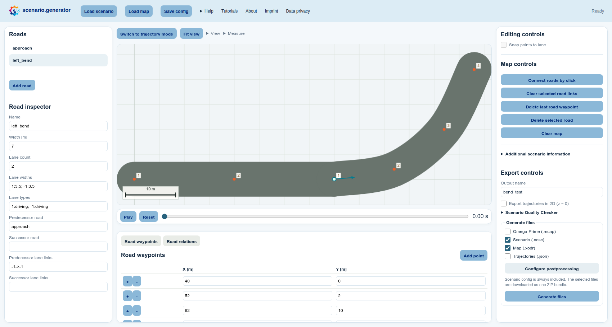
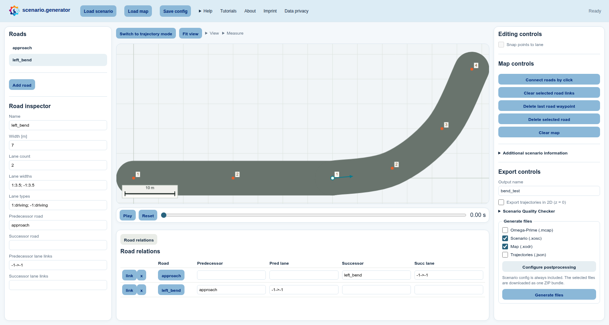
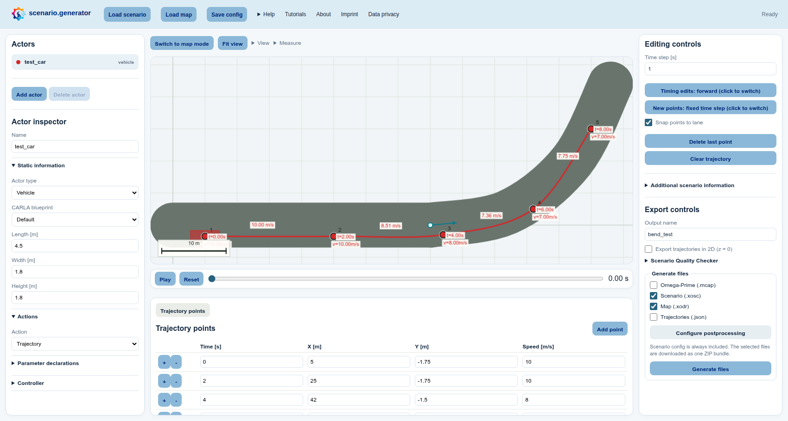

# Build a simple map and drive it

A small purpose-built map is ideal when you want to test a route without the
noise of a city-sized road network. In this tutorial, you create a straight
approach and a gentle bend, connect their lanes, and test the result with a
vehicle.

**Learning outcomes:** After this example, you can create roads, edit their
geometry and lane metadata, connect lanes, control the map overlays, place a
trajectory on a lane, save your work, and choose suitable export formats.

## Before you start: Map mode

scenario.generator opens in **Trajectory mode**. Select **Switch to map mode**
above the central canvas to edit roads instead of actors. Entering Map mode
does not create or change anything by itself, so you can safely switch back to
Trajectory mode at any time.

This tutorial creates a map from scratch. To start from an existing
[ASAM OpenDRIVE](https://www.asam.net/standards/detail/opendrive/) file instead,
open **Load map** and choose either a bundled map with **Load default** or a
local `.xodr` file with **Upload map**. You can also follow
[Create a rainy pedestrian crossing](03-import-adapt-map-scenario.md).

## 1. Draw the approach

1. Select **Switch to map mode** above the central canvas. The list on the left
   changes from **Actors** to **Roads**, and **Map controls** appear on the
   right.
2. Select a position near the left side of the central canvas. Use a pointer,
   or focus the canvas, move its keyboard cursor with the arrow keys, and press
   Enter. Because no map exists yet, this creates the first road and its first
   reference-line point. You can also select **Add road** below the **Roads**
   list before choosing a canvas position.
3. Add two more points in a straight line towards the centre of the canvas.
   You can drag the orange road points to refine the shape or enter exact
   coordinates in the **Road waypoints** table below the canvas.
4. In the **Road inspector** below the road list on the left, you can rename
   the road to `approach`. Configure its two lanes as follows:
   - **Lane count**: enter `2` to create two lanes around the road's reference
     line.
   - **Lane widths**: enter `-1:3.5; 1:3.5`. Each entry uses
     `lane ID:width in metres`, and the semicolon separates the lanes. Looking
     along the reference line in the order in which you clicked its points,
     lane `-1` is on the right and lane `1` is on the left. Both lanes are
     `3.5 m` wide, resulting in a total road width of `7 m`. The signs identify
     the side of the reference line; they do not directly specify the driving
     direction.
   - **Lane types**: enter `-1:driving; 1:driving`. This uses the same lane IDs
     and declares both lanes as driving lanes. The lane type affects the map
     representation, lane snapping, and the exported OpenDRIVE data.

## 2. Add and connect the bend

1. Select **Add road** below the **Roads** list on the left. In the **Road
   inspector**, you can rename it to `left_bend` and give it the same lane
   count, widths, and types as the approach.
2. On the central canvas, place the first point just beyond the end of the
   first road (`approach` if you renamed it), then select three or four
   positions that form a gentle left-hand bend. Canvas positions accept either
   pointer selection or the keyboard cursor and Enter. The exact number of
   points is not important; use enough points to describe a smooth reference
   line.
3. Open **View** above the canvas. Under **Map view**, enable **Road points**,
   **Lane numbers**, **Road centerlines**, and **Road connections**.
4. Under **Map controls** on the right, select **Connect road lanes**. On the
   canvas, first select the outgoing lane of the first road, then the matching
   lane on the second road. Both selections work with a pointer or the canvas
   keyboard cursor and Enter.

To inspect or edit the connection precisely, open **View → Table view** above
the canvas and enable **Road relations table**. In the table below the canvas,
check the predecessor and successor road names and their signed lane links.

## 3. Test-drive the map

1. Select **Switch to trajectory mode** above the canvas. In the **Actors**
   list on the left, select one vehicle.
2. Under **Editing controls** on the right, enable **Snap points to lane**.
   Then choose how to adapt the vehicle trajectory:
   - Select **Clear trajectory** in the same panel and select a new path from
     the approach into the bend with a pointer or the canvas keyboard cursor
     and Enter.
   - Reuse the initial trajectory by dragging its points onto the lanes or by
     editing their coordinates in the **Trajectory points** table below the
     canvas.
3. Select **Play** in the playback bar below the canvas. If a point snapped to
   the wrong lane, drag it closer to the intended lane or correct its exact
   coordinates in the **Trajectory points** table.
4. Select **Save config** in the light-blue header when you want an editable
   project file that preserves the trajectories and a reference to the map.
   The JSON does not embed OpenDRIVE XML, so keep the XODR beside it. The ZIP
   created by **Generate files** includes both automatically.

## 4. Export and post-process

1. In **Export controls** on the right, enter any useful **Output name**, for
   example `bend_test`. This only determines the downloaded filenames.
2. In **Generate files** below it, choose the formats that match your next
   step:
   - **Map (.xodr)** exports the road network as
     [ASAM OpenDRIVE](https://www.asam.net/standards/detail/opendrive/) so it can
     be reused by compatible map and simulation tools.
   - **Scenario (.xosc)** exports the actors and their behavior as
     [ASAM OpenSCENARIO XML](https://www.asam.net/standards/detail/openscenario-xml/).
     When XODR is selected as well, the scenario references the exported map.
   - **Trajectories (.json)** is convenient for inspecting or processing the
     clicked actor data with custom scripts.
   - **Omega-Prime (.mcap)** provides a portable traffic-data exchange format.
     [Omega-Prime](https://github.com/ika-rwth-aachen/omega-prime) is compatible
     with many tools available through the
     [SYNERGIES Marketplace](https://app.synergies-ccam.eu/).

   Select **Map (.xodr)** and **Scenario (.xosc)** to try the complete
   map-and-scenario workflow in this tutorial.
3. If you selected XOSC, choose **Configure postprocessing** in the same panel,
   select `set_stop_simulation_time`, and set the stop time to `15` seconds.
4. Select **Generate files** at the bottom of the right panel. The ZIP always
   contains the editable scenario configuration and additionally contains
   every selected format.

The result is a compact road-network test that is easy to understand, share,
and debug.
