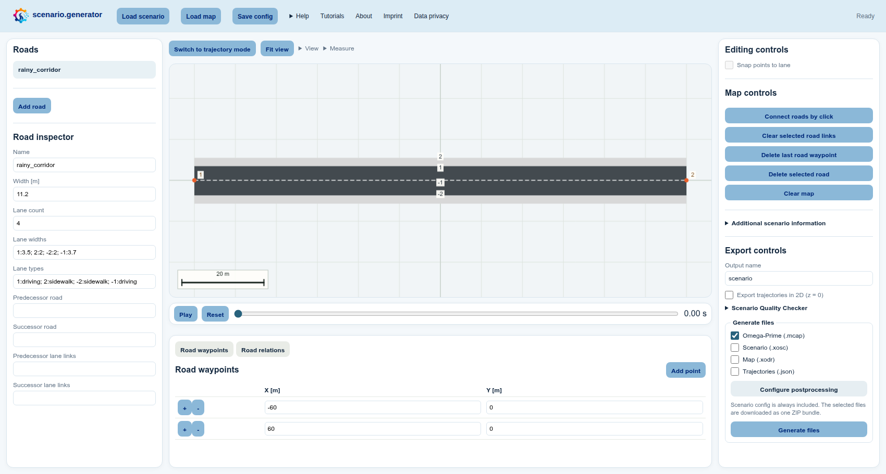
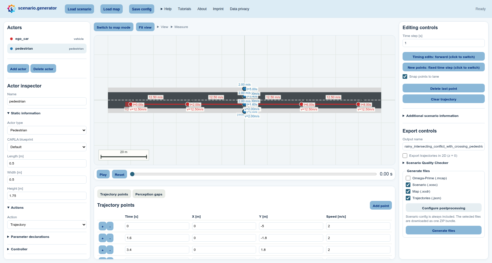
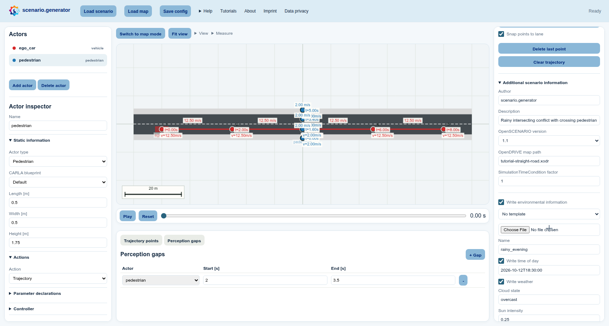

# Create a rainy pedestrian crossing on an imported map

This tutorial follows a common scenario-authoring workflow: import a map, make
one controlled change, place road users on it, add environmental context, and
export a complete test. The scenario is officially called **Rainy intersecting
conflict with crossing pedestrian**: an ego car approaches while a pedestrian
crosses the road in rain.

**Learning outcomes:** After this example, you can import and safely modify a
map, refine map-aware trajectories, configure actor types, dimensions, actions,
and an optional controller, add weather and perception gaps, inspect
criticality measures, run the quality checker, and choose suitable export
formats.

## Before you start: Imported maps

scenario.generator opens in **Trajectory mode**. Importing a map does not
change that mode: you can immediately use it as context for trajectories, or
select **Switch to map mode** above the canvas when you want to edit the road
network itself.

This tutorial starts from an existing map. To learn how to create and connect
roads from scratch, follow
[Build a simple map and drive it](02-create-simple-map.md).

> **Optional shortcut:** Open **Load scenario**, select
> **VRU crossing from left (.json)**, and choose **Load default** to load a
> completed vehicle–pedestrian encounter together with the **RITA junction**
> map. The vehicle follows the eastern approach and the pedestrian crosses
> between its sidewalks. In the bundled default, both actors reach the conflict
> point at `4.0 s`. To create the near-conflict described in this tutorial,
> first follow step 6 in section 2 and move the pedestrian's conflict time
> slightly earlier; then continue with section 3 to add rain and a perception
> gap. The manual steps below deliberately use a simpler straight road so that
> map adaptation and trajectory placement remain easy to practise.

## 1. Import and adapt the road

1. Open **Load map** in the light-blue header and select **Upload map** to open an
   [ASAM OpenDRIVE](https://www.asam.net/standards/detail/opendrive/) `.xodr`
   file. For this tutorial, download and use
   [tutorial-straight-road.xodr (Download)](/docs/download/tutorial-straight-road.xodr).
   If you want to practise on a larger road network, select the bundled
   **RITA junction (.xodr)** in the same dialog and choose **Load default**
   instead. Exact road names, waypoint positions, and screenshots in the
   manual steps below refer to the simpler tutorial map.
2. Decide when you want to modify the map:
   - To use it unchanged for now, remain in **Trajectory mode** and continue
     with section 2. You can return to the map at any later point.
   - To modify it now or later, select **Switch to map mode** above the central
     canvas whenever you are ready. Merely entering and leaving Map mode does
     not create an editable copy or change the imported file.
3. In Map mode, select the imported road in the **Roads** list on the left.
   Try your first actual change in the **Road inspector** below the list—for
   example, change **Name** to `rainy_corridor`.
4. The **Modify the imported map?** dialog appears only when you attempt that
   first change. Confirm it to create an editable copy; the uploaded source
   file remains untouched. If you cancel, no change is made. You can return
   later and the dialog will appear again when you next try to modify the map.
5. You can now adjust a lane width, drag a road point on the canvas, add a road,
   or change a road connection. After the editable copy has been created,
   further edits no longer require confirmation.
6. Open **View** above the canvas. Under **Map view**, enable **Road points**,
   **Lane numbers**, and **Road centerlines**, then select **Fit view** beside
   the menu.

## 2. Stage the rainy intersecting conflict

1. Select **Switch to trajectory mode** above the canvas. In the **Actors**
   list on the left, select `vehicle_1`. You can rename it to `ego_car` in the
   **Actor inspector** below the list.
2. Under **Editing controls** on the right, enable **Snap points to lane**.
   Select **Clear trajectory** in the same panel and select positions along one
   driving lane with a pointer or the canvas keyboard cursor and Enter.
   Alternatively, move the existing points onto that lane or edit their
   coordinates in the **Trajectory points** table below the canvas.
3. In the **Actors** list, select `vehicle_2`. You can rename it to
   `pedestrian`. Under **Actor inspector → Static information**, set **Actor
   type** to **Pedestrian**.
4. To practise changing actor dimensions, keep the pedestrian selected and set
   **Length** to `0.5 m`, **Width** to `0.5 m`, and **Height** to `1.75 m` in
   **Actor inspector → Static information**. These values affect its bounding
   box in scenario.generator as well as dimensions written to supported export
   formats.

   > **Note — CARLA blueprints:** Manually changing these fields does not resize
   > an actor when the scenario is played in
   > [CARLA](https://carla.readthedocs.io/). CARLA determines the physical actor
   > dimensions from the selected blueprint. Choose a matching **CARLA
   > blueprint** when its in-simulator dimensions matter.

5. Disable **Snap points to lane** under **Editing controls** on the right.
   Clear and redraw the pedestrian trajectory across the road, or move its
   existing points on the canvas or in the table. Any waypoint shared by both
   paths can be the intersecting point; it does not need a particular index.
6. At the pedestrian's intersecting point, choose a time that lets the
   pedestrian pass shortly before the car. Double-click its canvas time label
   or edit **Time [s]** in the **Trajectory points** table. Use **Timing edits:
   forward/backward** according to which part of the trajectory should be
   recalculated.
7. For both actors, keep **Action** set to **Trajectory** under **Actor
   inspector → Actions** on the left. Their selected and timed paths will then
   be exported as
   [ASAM OpenSCENARIO XML](https://www.asam.net/standards/detail/openscenario-xml/)
   trajectory actions.
8. **Optional controller:** Select the actor that should be controlled and
   expand **Controller** in the **Actor inspector** on the left. Enter the
   controller name expected by your target simulator, then either paste a
   complete OpenSCENARIO `Controller` or `ControllerAction` into **Controller
   XML**, or use **Load controller** to import a `.json`, `.xml`, or `.xosc`
   template. The controller is embedded in the XOSC export; scenario.generator
   does not execute it, so leave these fields empty unless your target runtime
   supports that controller. For a concrete controller template and all
   required conventions, see
   [Test OpenADStack in OpenADSim](04-openads-scenario.md#2-assign-the-openadstack-ego-controller).

## 3. Add weather and limited perception

1. Expand **Additional scenario information** in the right sidebar below
   **Editing controls**.
2. Enable **Write environmental information** and select the **rainy evening**
   template directly below it. Review the time of day, precipitation,
   visibility, and road-friction fields populated by the template.
3. Open **View → Table view** above the canvas and enable **Perception gaps**.
   In the new **Perception gaps** tab below the canvas, select **+ Gap** and set
   the actor to the second actor (`pedestrian` if you renamed it), the start
   time to `2.0 s`, and the end time to `3.5 s`.

   > **Note — JSON only:** A perception gap only changes the `detected` values
   > in the **Trajectories (.json)** export. It is not applied to XOSC, XODR,
   > or Omega-Prime MCAP output. If you do not use the trajectory JSON, the gap
   > has no effect on the generated simulation or exchange files. It is still
   > retained in the editable scenario configuration so you can continue
   > working on it later.

4. Select **Play** in the playback bar below the canvas and inspect the
   encounter with the time slider. For additional criticality information,
   open **View → Road user view** above the canvas and enable **TTC min** and
   **THW min**.

## 4. Validate, export, and post-process

1. Under **Export controls** on the right, expand **Scenario Quality Checker**
   and select **Check scenario quality**. Fix actionable problems before
   exporting; warnings can also document intentional test conditions. The
   checker is maintained as the external
   [scenario_quality_checker](https://github.com/ika-rwth-aachen/scenario_quality_checker)
   project.
2. Enter any useful **Output name**, for example
   `rainy_intersecting_conflict_with_crossing_pedestrian`. This only determines
   the downloaded filenames.
3. In **Generate files**, choose the formats that match your next step:
   - **Scenario (.xosc)** exports the actors, actions, timing, and environment
     as ASAM OpenSCENARIO XML.
   - **Map (.xodr)** exports the current ASAM OpenDRIVE map, including any
     adaptations you made. Select it together with XOSC when the map should
     also be an explicit output; the config's map dependency is included in
     the portable ZIP automatically.
   - **Trajectories (.json)** is convenient for inspecting the selected actor
     data or processing it with custom scripts. It is also the only export in
     which the configured perception gap changes the data.
   - **Omega-Prime (.mcap)** provides a portable traffic-data exchange format.
     [Omega-Prime](https://github.com/ika-rwth-aachen/omega-prime) is compatible
     with many tools available through the
     [SYNERGIES Marketplace](https://app.synergies-ccam.eu/).

   Select **Scenario (.xosc)**, **Map (.xodr)**, and **Trajectories (.json)**
   to try both the simulation and data-processing workflows in this tutorial.
4. If you selected XOSC, choose **Configure postprocessing** in the same panel,
   select `set_stop_simulation_time`, and set the stop time to `20` seconds.
5. Select **Generate files** at the bottom of the right panel. The ZIP always
   contains the editable scenario configuration and additionally contains
   every selected format.

You can reuse this workflow for real scenarios by replacing the map and actor
positions while keeping the same import → adapt → stage → inspect → validate →
export rhythm.
