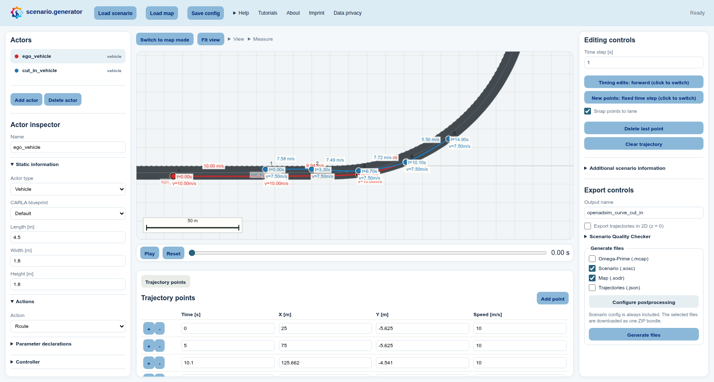
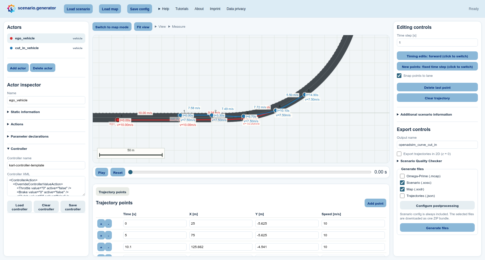
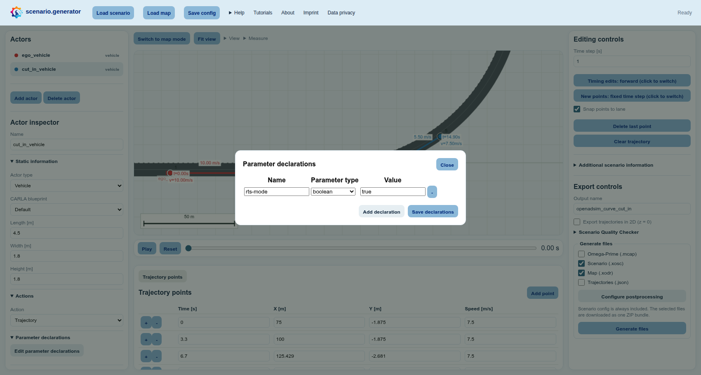

# Test OpenADStack in OpenADSim

[OpenADS](https://openads-project.github.io/) is an open ecosystem for developing
and testing automated-driving systems. It defines
[OpenADStack](https://github.com/openads-project/openadstack), a modular
reference system for automated driving, which can be tested in the
[OpenADSim](https://github.com/openads-project/openadsim) simulation environment.
Such tests require scenarios that describe the road environment, traffic
participants, and their behavior.

This tutorial shows how to create an OpenADS-compliant scenario for testing the
reference stack in OpenADSim. It uses a cut-in as an example: OpenADStack drives
`ego_vehicle`, while OpenADSim and the CARLA scenario runner execute the
surrounding traffic and let you observe how the stack responds to the cut-in
vehicle.

**Learning outcomes:** After this example, you can prepare a map-aware
[OpenSCENARIO](https://www.asam.net/standards/detail/openscenario-xml/) test for
OpenADSim, assign the OpenADStack ego controller, declare the trajectory
parameters required for non-ego actors, export the required files, and prepare
them for an OpenADSim run.

## Before you start: choose a map OpenADSim can use

An OpenADSim simulation always runs on a map, but supplying your own map file is
optional: you can also select one of its prebuilt maps. A scenario must refer to
the same map that OpenADSim loads.

This tutorial uses OpenADSim's supported `synthetic_curve_cut_in` example map.
It is a helpful choice because the OpenADSim repository provides both parts
needed for this closed-loop OpenADStack test:

- [OpenDRIVE](https://www.asam.net/standards/detail/opendrive/), which CARLA uses
  for the simulation road network; and
- the matching
  [Lanelet2 map](https://github.com/openads-project/openadsim/blob/main/carla-simulation/scenarios/simple-scenario/synthetic_curve_cut_in.osm),
  which OpenADStack uses for map-based route planning.

For an OpenADSim test without OpenADStack, a custom OpenDRIVE map can be enough.
When OpenADStack should drive on a custom map, you generally also need a matching
Lanelet2 map. The available prebuilt maps and the custom-map settings are listed
in the official
[OpenADSim configuration guide](https://github.com/openads-project/openadsim/blob/main/docs/configuration.md).

## 1. Create a cut-in test on the supported map

> **Optional shortcut:** Choose **Load scenario**, select **Cut-in from left on
> curved road (.json)**, and choose **Load default** to inspect a completed
> cut-in whose trajectories and `synthetic_curve_cut_in.xodr` map are loaded
> together. Continue with the manual steps below when you want to build the
> scenario yourself.

1. Open **Load map** in the light-blue header and select **Upload map** to import
   [synthetic_curve_cut_in.xodr (Download)](/docs/download/synthetic_curve_cut_in.xodr).
   This is a local copy of the
   [map shipped with OpenADSim](https://github.com/openads-project/openadsim/blob/main/carla-simulation/scenarios/simple-scenario/synthetic_curve_cut_in.xodr).
   If that map is bundled as a default in your deployment, select it and choose
   **Load default** instead.
2. In the **Actors** list on the left, select the first actor. In the **Actor
   inspector** below the list, rename it exactly `ego_vehicle`. OpenADSim uses
   this name to identify the vehicle controlled by OpenADStack.
3. Under **Editing controls** on the right, enable **Snap points to lane** and
   select **Clear trajectory**. Select route positions for `ego_vehicle` along
   the outer driving lane, starting on the straight section and continuing into
   the bend. Use a pointer or the canvas keyboard cursor and Enter. You can move
   a misplaced point on the canvas or correct its coordinates in the
   **Trajectory points** table below the canvas.
4. In **Actor inspector → Actions** on the left, set **Action** to **Route**.
   The selected points will then be exported as an OpenSCENARIO
   `AssignRouteAction` for the OpenADStack controller.
5. Select the second actor and rename it `cut_in_vehicle`. Place its trajectory
   in the neighbouring lane ahead of `ego_vehicle`, then let it cross the dashed
   lane marking into the ego lane on the bend. Keep **Action** set to
   **Trajectory** so OpenADSim can reproduce the actor's timed movement.
6. Double-click the time or speed labels on the canvas, or use the
   **Trajectory points** table below it, to make the cut-in happen while the ego
   vehicle is approaching. The test now has a clear purpose: observe whether
   OpenADStack reacts safely to the lane change.

## 2. Assign the OpenADStack ego controller

1. Select `ego_vehicle` in the **Actors** list on the left and expand
   **Controller** in the **Actor inspector** below it.
2. The controller template cannot currently be selected from a built-in list.
   Select [karl-controller-template.json (Download)](/docs/download/karl-controller-template.json),
   then select **Load controller** in the **Controller** section and choose the
   downloaded file.

3. In **Controller XML**, verify that the imported XML contains controller
   `RosRouteController` and module
   `ros_vehicle_control_route_action.py`. This controller passes the
   OpenSCENARIO route to OpenADStack while leaving direct vehicle control to the
   stack.

## 3. Declare trajectory parameters

Repeat these steps for `cut_in_vehicle` and every additional actor except
`ego_vehicle`:

1. Select the actor in the **Actors** list on the left.
2. Expand **Parameter declarations** in the **Actor inspector** and select
   **Edit parameter declarations**.
3. In the dialog, select **Add declaration** and enter name `rts-mode`, type
   `boolean`, and value `true` (Boolean `True`). Then select
   **Save declarations**.

Do **not** add this declaration to `ego_vehicle`: OpenADStack controls the ego
through its route controller, while `rts-mode = true` belongs to the
trajectories executed for the other actors.

## 4. Export and prepare the OpenADSim run

1. Expand **Additional scenario information** in the **Actor inspector** on the
   left. Set **OpenDRIVE map path** to
   `synthetic_curve_cut_in.xodr`, matching the map filename that OpenADSim will
   load.
2. In **Export controls** on the right, enter any useful **Output name**, for
   example `openadsim_curve_cut_in`. This only determines the downloaded
   filenames.
3. Under **Generate files**, select only the formats needed here:

   - **Scenario (.xosc)** contains the route, controller, timed cut-in
     trajectory, and trajectory parameters.
   - **Map (.xodr)** contains the custom CARLA road network.

   **Trajectories (.json)** and **Omega-Prime (.mcap)** can also be exported,
   but neither format is relevant to OpenADSim scenario execution. Both formats
   represent route actions as trajectories and are therefore not needed in
   this example.
4. Select **Configure postprocessing** in the same panel. Enable
   `set_stop_simulation_time` and choose a duration that leaves enough time for
   the cut-in and the stack's response, for example `30` seconds. Apply the
   postprocessing configuration.
5. Select **Generate files** at the bottom of the right panel. Keep the exported
   XOSC and XODR together so the relative map reference resolves.

After export, prepare the files for OpenADSim. The official
[OpenADSim scenario-execution example](https://github.com/openads-project/openadsim/blob/main/docs/example-scenario-execution.md)
provides the corresponding reference workflow:

1. Place the XOSC and XODR in an OpenADSim scenario directory and download the
   matching
   [`synthetic_curve_cut_in.osm` (Download)](https://raw.githubusercontent.com/openads-project/openadsim/main/carla-simulation/scenarios/simple-scenario/synthetic_curve_cut_in.osm)
   into the OpenADSim map setup.
2. In the OpenADSim Configuration GUI, select CARLA with scenario execution,
   configure the exported XODR as `CUSTOM_OPENDRIVE`, the matching OSM as
   `CUSTOM_LANELET`.
3. Select the exported XOSC as `SCENARIO_FILE`. Confirm that its
   `RoadNetwork/LogicFile` still names `synthetic_curve_cut_in.xodr`.
4. Start the run and observe `ego_vehicle` in CARLA or RViz. The CARLA scenario
   runner controls `cut_in_vehicle`, while OpenADStack drives `ego_vehicle` in
   closed loop.

Before running, check four things:

- the ego actor is named exactly `ego_vehicle`;
- every non-ego actor, and only those actors, declares Boolean
  `rts-mode = true`;
- `ego_vehicle` contains `RosRouteController` with
  `ros_vehicle_control_route_action.py`; and
- XOSC, XODR, and Lanelet2 OSM all describe the same supported map.

The result is an OpenADS example in the concrete sense intended here:
OpenADStack is the system under test, and OpenADSim provides its reproducible
closed-loop test environment.
